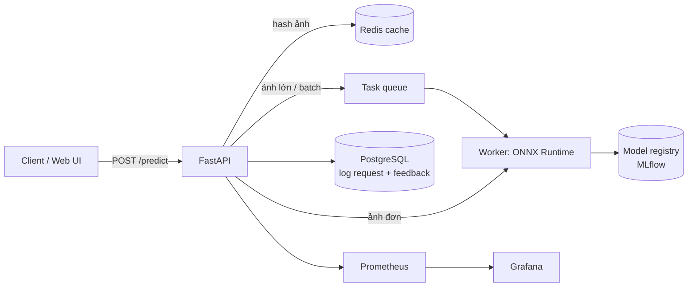

# P01 — Image Classifier as a Service (Món ăn Việt)

> Fine-tune CNN nhận diện **30 món ăn Việt Nam**, đóng gói thành **API production-grade**: có cache, hàng đợi, giám sát, CI/CD, deploy công khai.
> Mục tiêu thật sự không phải accuracy, mà là **học cách đưa một model ra production** — nền tảng cho mọi dự án sau.

| Mục | Chi tiết |
|---|---|
| Hướng | Backend + CV (nền tảng MLOps) |
| Độ khó | ⭐⭐ |
| Thời gian | 3–4 tuần |
| Bài học áp dụng | [07 ConvNets](https://github.com/microsoft/AI-For-Beginners/tree/main/lessons/4-ComputerVision/07-ConvNets), [08 Transfer Learning](https://github.com/microsoft/AI-For-Beginners/tree/main/lessons/4-ComputerVision/08-TransferLearning), [05 Frameworks](https://github.com/microsoft/AI-For-Beginners/tree/main/lessons/3-NeuralNetworks/05-Frameworks) |
| Vị trí phù hợp | Backend Engineer, ML Engineer, MLOps Engineer |

---

## 1. Bài toán

Người dùng gửi ảnh → API trả về top-5 món ăn + xác suất. Hệ thống phải: chịu tải đồng thời, không chết khi ảnh lỗi, đo được latency, cập nhật model mới không downtime.

## 2. Kiến trúc

## 3. Tech stack

PyTorch + timm · ONNX Runtime · FastAPI · Pydantic · Redis · PostgreSQL + SQLAlchemy · Celery/Arq · MLflow · Docker Compose · GitHub Actions · Prometheus/Grafana · Locust · (UI: Streamlit hoặc Gradio)

## 4. Kiến thức cần nắm

### AI/ML
- [ ] Transfer learning: freeze backbone → fine-tune toàn bộ; so sánh ResNet50 / EfficientNet / ConvNeXt / ViT nhỏ
- [ ] Data augmentation (RandAugment, MixUp/CutMix), class imbalance (weighted loss)
- [ ] Metric: top-1/top-5 accuracy, confusion matrix, per-class F1; **calibration** (xác suất có đáng tin không?)
- [ ] Export ONNX, quantization INT8 (dynamic/static), đo tốc độ trên CPU
- [ ] Giải thích dự đoán: Grad-CAM (trả heatmap trong API — điểm cộng khi demo)

### Backend
- [ ] Endpoint `POST /v1/predict` (multipart upload), `GET /health`, `GET /metrics`
- [ ] Validate file (MIME, kích thước, ảnh hỏng), trả lỗi rõ ràng (4xx vs 5xx)
- [ ] Cache theo hash nội dung ảnh (SHA-256) trong Redis
- [ ] Load model **một lần** khi khởi động (lifespan event), không load mỗi request
- [ ] Endpoint `POST /v1/feedback` để người dùng sửa nhãn → lưu DB → dữ liệu retrain
- [ ] Rate limit theo API key

### MLOps/DevOps
- [ ] MLflow: log hyperparameter, metric, artifact; "promote" model từ staging → production
- [ ] Dockerfile multi-stage (image < 1GB), `docker compose up` chạy toàn bộ
- [ ] CI: ruff + pytest + build image; CD: deploy Cloud Run / Render / HF Spaces
- [ ] Load test bằng Locust: đo p50/p95/p99 ở 10/50/100 user đồng thời
- [ ] Dashboard Grafana: request/s, latency, tỉ lệ lỗi, phân bố lớp dự đoán (phát hiện drift)

## 5. Lộ trình

| Tuần | Milestone | Deliverable |
|---|---|---|
| 1 | Train baseline trên Kaggle/Colab | Notebook + MLflow run, accuracy baseline |
| 2 | FastAPI + Docker | `docker compose up` → gọi được `/predict` |
| 3 | Redis cache, DB log, feedback, test, CI | Pipeline GitHub Actions xanh |
| 4 | ONNX + quantization, load test, Grafana, deploy | Bảng so sánh PyTorch vs ONNX vs INT8 (latency, accuracy); link demo |

## 6. Dữ liệu

- [30VNFoods — Kaggle](https://www.kaggle.com/datasets/quandang/vietnamese-foods): ~25k ảnh, 30 món (license CC BY-NC-SA 4.0 → chỉ dùng phi thương mại).
- Bổ sung: tự chụp/thu thập thêm cho lớp ít dữ liệu (ghi rõ nguồn).

## 7. Repo tham khảo

| Repo | Dùng để học |
|---|---|
| [huggingface/pytorch-image-models](https://github.com/huggingface/pytorch-image-models) | Backbone pretrained (timm) |
| [fastapi/full-stack-fastapi-template](https://github.com/fastapi/full-stack-fastapi-template) | Cấu trúc project FastAPI chuẩn |
| [zhanymkanov/fastapi-best-practices](https://github.com/zhanymkanov/fastapi-best-practices) | Quy ước code FastAPI |
| [microsoft/onnxruntime](https://github.com/microsoft/onnxruntime) | Suy luận nhanh trên CPU |
| [bentoml/BentoML](https://github.com/bentoml/BentoML) | So sánh với cách tự viết serving |
| [mlflow/mlflow](https://github.com/mlflow/mlflow) | Experiment tracking + model registry |
| [locustio/locust](https://github.com/locustio/locust) | Load test |
| [GokuMohandas/Made-With-ML](https://github.com/GokuMohandas/Made-With-ML) | Quy trình ML end-to-end |

## 8. Bài báo liên quan

- ResNet, ViT, MAE — xem [00-Foundations-Classics.md](../../Research-Papers/00-Foundations-Classics.md)
- *Challenges in Deploying Machine Learning* & *Hidden Technical Debt in ML Systems* — xem [04-ML-Systems-MLOps-RecSys.md](../../Research-Papers/04-ML-Systems-MLOps-RecSys.md)

## 9. Trình bày trên CV

- Bảng: Model | Top-1 | Latency p95 (CPU) | Kích thước — cho PyTorch FP32 / ONNX FP32 / ONNX INT8.
- Ảnh chụp dashboard Grafana khi load test.
- Bullet mẫu: *"Deployed a fine-tuned image classifier behind FastAPI with Redis caching and ONNX INT8, cutting p95 latency by __% at __ RPS; CI/CD via GitHub Actions."*

## 10. Mở rộng

- A/B test 2 model (chia traffic 90/10), shadow deployment.
- Active learning: ưu tiên gán nhãn các ảnh model ít tự tin nhất.
- Thay classifier bằng zero-shot CLIP/SigLIP (so sánh với fine-tune) → nối sang P05.
