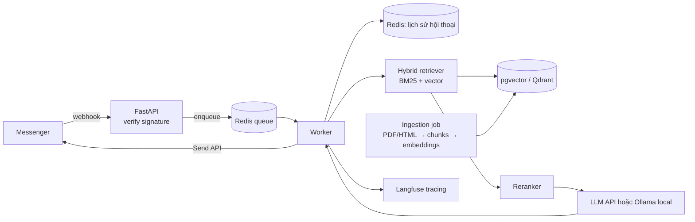

# P02 — RAG Chatbot trên Messenger (nâng cấp `fb-messenger-bot`)

> Biến bot "roger that!" hiện tại trong [`../../fb-messenger-bot`](../../fb-messenger-bot/app.py) thành **trợ lý hỏi–đáp tiếng Việt** dựa trên tài liệu thật (ví dụ: *quy chế đào tạo / sổ tay sinh viên của trường bạn*), có trích dẫn nguồn, nhớ ngữ cảnh hội thoại và có **bộ đánh giá chất lượng**.
> Người dùng thật = bạn cùng lớp → bạn có feedback thật để ghi vào CV.

| Mục | Chi tiết |
|---|---|
| Hướng | Backend + LLM (AI Engineer) |
| Độ khó | ⭐⭐⭐ |
| Thời gian | 4–5 tuần |
| Bài học áp dụng | [13 TextRep](https://github.com/microsoft/AI-For-Beginners/tree/main/lessons/5-NLP/13-TextRep), [14 Embeddings](https://github.com/microsoft/AI-For-Beginners/tree/main/lessons/5-NLP/14-Embeddings), [18 Transformers](https://github.com/microsoft/AI-For-Beginners/tree/main/lessons/5-NLP/18-Transformers), [20 LangModels](https://github.com/microsoft/AI-For-Beginners/tree/main/lessons/5-NLP/20-LangModels) |
| Vị trí phù hợp | AI Engineer, Backend Engineer (LLM), Chatbot Engineer |

---

## 1. Hiện trạng code của bạn & việc cần sửa trước

| Vấn đề trong `app.py` | Cách sửa |
|---|---|
| `log()` dùng `unicode()` (Python 2) → `NameError` trên Python 3 | Dùng `logging` chuẩn, log JSON |
| Gọi `graph.facebook.com/v2.6` — phiên bản rất cũ | Dùng phiên bản Graph API hiện hành theo [tài liệu Messenger Platform](https://developers.facebook.com/docs/messenger-platform/), đưa version vào biến môi trường |
| Không xác thực chữ ký webhook | Kiểm tra header `X-Hub-Signature-256` bằng App Secret (HMAC-SHA256) |
| Xử lý đồng bộ trong request webhook | Trả `200` ngay, đẩy việc gọi LLM vào background queue (Meta sẽ gửi lại nếu webhook chậm) |
| `message["text"]` sẽ lỗi khi người dùng gửi ảnh/sticker | Kiểm tra loại message, xử lý attachments |
| Flask + Heroku template | Chuyển sang FastAPI (async) + Docker |

## 2. Kiến trúc

## 3. Tech stack

FastAPI · Redis (queue + memory) · PostgreSQL + pgvector (hoặc Qdrant) · `bge-m3` embeddings · reranker (`bge-reranker`) · LLM (API thương mại hoặc Qwen/Llama chạy qua Ollama) · LlamaIndex hoặc tự viết · Ragas · Langfuse · Docker Compose · (Vietnamese NLP: underthesea)

## 4. Kiến thức cần nắm

### Backend
- [ ] Webhook: verify token (GET), xác thực chữ ký HMAC (POST), idempotency (Meta có thể gửi trùng event → khử trùng theo `mid`)
- [ ] Async worker, retry khi LLM timeout, giới hạn độ dài tin nhắn Messenger (chia nhỏ câu trả lời)
- [ ] Lưu hội thoại theo `sender_id` (TTL), quản lý context window
- [ ] Bảo mật: secret trong biến môi trường, không log nội dung nhạy cảm

### AI / NLP
- [ ] Tách câu/từ tiếng Việt ([underthesea](https://github.com/undertheseanlp/underthesea)) cho BM25
- [ ] Chunking: theo cấu trúc tài liệu (Chương/Điều/Khoản) tốt hơn chia theo số ký tự — hãy so sánh
- [ ] Embedding đa ngôn ngữ: [BAAI/bge-m3](https://huggingface.co/BAAI/bge-m3) (dense + sparse); so với PhoBERT mean-pooling
- [ ] Hybrid search + Reciprocal Rank Fusion, rerank bằng cross-encoder
- [ ] Prompt có trích dẫn `[Điều X, trang Y]`, từ chối trả lời khi không đủ bằng chứng
- [ ] Query rewriting cho câu hỏi nối tiếp ("thế còn học kỳ hè?")
- [ ] Đánh giá: tự tạo **50–100 câu hỏi vàng**, đo Recall@k của retriever, faithfulness/answer relevancy bằng [Ragas](https://github.com/vibrantlabsai/ragas)

### MLOps
- [ ] Tracing từng bước (retrieve → rerank → generate) bằng [Langfuse](https://github.com/langfuse/langfuse); đo chi phí token/latency
- [ ] Chạy lại bộ đánh giá trong CI mỗi khi đổi prompt/chunking (regression test cho LLM)

## 5. Lộ trình

| Tuần | Milestone |
|---|---|
| 1 | Sửa bug, chuyển FastAPI + Docker, xác thực chữ ký, queue; bot echo chạy ổn định |
| 2 | Pipeline ingestion (PDF → chunk → embed → pgvector); API `/ask` trả lời có trích dẫn |
| 3 | Hybrid search + rerank + memory; nối vào Messenger |
| 4 | Bộ câu hỏi vàng + Ragas + Langfuse; bảng so sánh các cấu hình (chunking, có/không rerank) |
| 5 | Mời 10–20 bạn dùng thử, thu feedback 👍/👎, viết blog |

## 6. Repo tham khảo

| Repo | Ghi chú |
|---|---|
| [hartleybrody/fb-messenger-bot](https://github.com/hartleybrody/fb-messenger-bot) | Template gốc của bạn |
| [pgvector/pgvector](https://github.com/pgvector/pgvector) · [qdrant/qdrant](https://github.com/qdrant/qdrant) | Vector store |
| [FlagOpen/FlagEmbedding](https://github.com/FlagOpen/FlagEmbedding) | bge-m3, bge-reranker |
| [run-llama/llama_index](https://github.com/run-llama/llama_index) | Framework RAG (nên tự viết 1 bản tối giản trước để hiểu) |
| [infiniflow/ragflow](https://github.com/infiniflow/ragflow) | Tham khảo RAG engine hoàn chỉnh, parsing tài liệu |
| [microsoft/graphrag](https://github.com/microsoft/graphrag) | Mở rộng: RAG dựa trên đồ thị tri thức |
| [vibrantlabsai/ragas](https://github.com/vibrantlabsai/ragas) | Đánh giá RAG |
| [langfuse/langfuse](https://github.com/langfuse/langfuse) | Observability cho LLM |
| [ollama/ollama](https://github.com/ollama/ollama) | Chạy LLM local miễn phí |
| [VinAIResearch/PhoBERT](https://github.com/VinAIResearch/PhoBERT) · [undertheseanlp/underthesea](https://github.com/undertheseanlp/underthesea) | NLP tiếng Việt |

## 7. Bài báo liên quan

RAG (2005.11401), Lost in the Middle, Self-RAG, RAPTOR, GraphRAG, ColBERT, M3-Embedding, Ragas, *LLMs Get Lost in Multi-Turn Conversation* (ICLR 2026 Outstanding) — xem [02-LLM-Agents-RAG.md](../../Research-Papers/02-LLM-Agents-RAG.md).

## 8. Trình bày trên CV

- Bảng ablation: cấu hình → Recall@5, faithfulness, latency, chi phí/1000 câu hỏi.
- *"Rebuilt a Messenger bot into a Vietnamese RAG assistant (hybrid BM25+dense retrieval, reranking, citations) serving __ students; improved Recall@5 from __ to __ via structure-aware chunking; async webhook processing with Redis queue."*

## 9. Mở rộng

- Voice message → ASR bằng [openai/whisper](https://github.com/openai/whisper).
- Agentic RAG: bot tự quyết định khi nào cần tra cứu, khi nào hỏi lại người dùng.
- Kết nối nhiều kênh (Telegram, Zalo OA, web widget) qua một lớp adapter chung.
