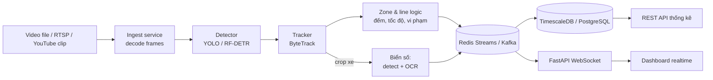

# P03 — Traffic Video Analytics (đếm xe, theo dõi, đọc biển số)

> Hệ thống nhận **video/stream giao thông** → phát hiện & theo dõi phương tiện (xe máy, ô tô, xe buýt…) → đếm lưu lượng theo làn/hướng, đo tốc độ ước lượng, phát hiện vi phạm đơn giản (đi vào vùng cấm), đọc biển số → **dashboard realtime**.
> Chỉ cần video (quay bằng điện thoại từ cầu vượt, hoặc video công khai) — **không cần phần cứng/camera chuyên dụng**.

| Mục | Chi tiết |
|---|---|
| Hướng | Computer Vision + Backend (streaming) |
| Độ khó | ⭐⭐⭐⭐ |
| Thời gian | 5–7 tuần |
| Bài học áp dụng | [11 Object Detection](https://github.com/microsoft/AI-For-Beginners/tree/main/lessons/4-ComputerVision/11-ObjectDetection), [12 Segmentation](https://github.com/microsoft/AI-For-Beginners/tree/main/lessons/4-ComputerVision/12-Segmentation), [08 Transfer Learning](https://github.com/microsoft/AI-For-Beginners/tree/main/lessons/4-ComputerVision/08-TransferLearning) |
| Vị trí phù hợp | Computer Vision Engineer, ML Engineer, Backend (video/IoT platform) |

---

## 1. Bài toán & giá trị

Giao thông VN có mật độ **xe máy rất cao, che khuất nhiều** — model pretrained trên COCO thường kém → cơ hội fine-tune và đo cải thiện. Ứng dụng: smart city, bãi giữ xe, tính lưu lượng cho quy hoạch.

## 2. Kiến trúc

## 3. Tech stack

Ultralytics YOLO (hoặc RF-DETR) · supervision · ByteTrack · PaddleOCR / VietOCR · OpenCV / PyAV · FastAPI (REST + WebSocket) · Redis Streams (hoặc Kafka) · TimescaleDB · React/Streamlit dashboard · Docker Compose

## 4. Kiến thức cần nắm

### Computer Vision
- [ ] Detector một giai đoạn (YOLO) vs. DETR-style (RT-DETR, RF-DETR, D-FINE); anchor-free, NMS vs. NMS-free
- [ ] Metric: mAP@0.5, mAP@0.5:0.95, precision/recall theo lớp; FPS
- [ ] Fine-tune trên dữ liệu giao thông VN; gán nhãn bằng [Label Studio](https://github.com/HumanSignal/label-studio) hoặc auto-label bằng open-vocabulary detector (Grounding DINO / YOLO-World) rồi sửa tay
- [ ] Multi-object tracking: Kalman filter, Hungarian matching, ByteTrack; metric MOTA/IDF1/HOTA
- [ ] Hình học: homography (biến đổi phối cảnh → mặt đường) để ước lượng tốc độ
- [ ] Nhận diện biển số: detect biển → chỉnh phối cảnh → OCR (biển VN có 1 và 2 dòng!)
- [ ] Tối ưu suy luận: batch frames, half precision, ONNX/TensorRT export, bỏ frame (frame skipping)

### Backend / Streaming
- [ ] Mô hình producer–consumer, backpressure khi model chậm hơn tốc độ video
- [ ] Redis Streams / Kafka: consumer group, ack, replay
- [ ] Time-series DB: hypertable, continuous aggregate (thống kê theo 1 phút / 15 phút)
- [ ] WebSocket đẩy sự kiện realtime lên dashboard
- [ ] Lưu snapshot sự kiện vào object storage (MinIO)

### Đạo đức & pháp lý
- [ ] **Làm mờ khuôn mặt và biển số** trong demo công khai; không lưu dữ liệu cá nhân lâu hơn cần thiết (xem bài [07 Ethics](https://github.com/microsoft/AI-For-Beginners/tree/main/lessons/7-Ethics))

## 5. Lộ trình

| Tuần | Milestone |
|---|---|
| 1 | Chạy YOLO pretrained + ByteTrack trên video mẫu, đếm xe qua 1 đường kẻ |
| 2 | Gán nhãn ~500–1000 frame giao thông VN; fine-tune; bảng mAP trước/sau |
| 3 | Kiến trúc service: ingest → detect/track → Redis Streams → DB |
| 4 | Dashboard realtime (WebSocket) + API thống kê |
| 5 | Nhận diện biển số (detect + OCR), đo accuracy theo ký tự & theo biển |
| 6–7 | Tối ưu FPS (ONNX/half precision), xử lý nhiều stream, load test, viết blog |

## 6. Dữ liệu

- Tự quay video (điện thoại, từ cầu vượt) — nguồn dữ liệu "độc quyền" của bạn, rất có giá trị.
- Tìm dataset xe/biển số Việt Nam trên [Roboflow Universe](https://roboflow.com/universe) (kiểm tra license từng dataset).
- COCO (lớp car/motorcycle/bus/truck) để pretrain/đối chiếu.

## 7. Repo tham khảo

| Repo | Ghi chú |
|---|---|
| [ultralytics/ultralytics](https://github.com/ultralytics/ultralytics) | YOLO train/detect/track (lưu ý license AGPL-3.0) |
| [roboflow/rf-detr](https://github.com/roboflow/rf-detr) | Detector transformer real-time, license Apache-2.0 |
| [roboflow/supervision](https://github.com/roboflow/supervision) | Zone, line counter, annotator, tracker tiện dụng |
| [FoundationVision/ByteTrack](https://github.com/FoundationVision/ByteTrack) | Thuật toán tracking gốc |
| [IDEA-Research/GroundingDINO](https://github.com/IDEA-Research/GroundingDINO) · [AILab-CVC/YOLO-World](https://github.com/AILab-CVC/YOLO-World) | Auto-labeling bằng open-vocabulary |
| [PaddlePaddle/PaddleOCR](https://github.com/PaddlePaddle/PaddleOCR) · [pbcquoc/vietocr](https://github.com/pbcquoc/vietocr) | OCR (VietOCR cho tiếng Việt) |
| [timescale/timescaledb](https://github.com/timescale/timescaledb) | Lưu sự kiện theo thời gian |
| [roboflow/notebooks](https://github.com/roboflow/notebooks) | Notebook mẫu fine-tune/tracking |

## 8. Bài báo liên quan

YOLO, Faster R-CNN, DETR, RT-DETR, YOLOv10/v12, **YOLO26 (2026)**, RF-DETR, DEIMv2, D-FINE, ByteTrack, Grounding DINO, YOLO-World, SAM 2/3 — xem [01-Computer-Vision.md](../../Research-Papers/01-Computer-Vision.md).

## 9. Trình bày trên CV

- Bảng: model × (mAP xe máy, mAP ô tô, FPS trên GPU Colab/CPU).
- GIF dashboard + video có bounding box, ID tracking.
- *"Built a real-time traffic analytics pipeline (detector + ByteTrack + Redis Streams + TimescaleDB) processing __ FPS per stream; fine-tuning on __ annotated Vietnamese traffic frames raised motorbike mAP@0.5 from __ to __."*

## 10. Mở rộng / nghiên cứu

- Benchmark nhỏ: "Open-vocabulary detectors trên giao thông mật độ xe máy cao" — xem [06-Research-Ideas.md](../../Research-Papers/06-Research-Ideas.md).
- Phân vùng làn đường bằng SAM 3 (prompt bằng chữ "lane", "sidewalk").
- Hỏi đáp trên video bằng VLM ("Có bao nhiêu xe vượt đèn đỏ trong 5 phút qua?").
