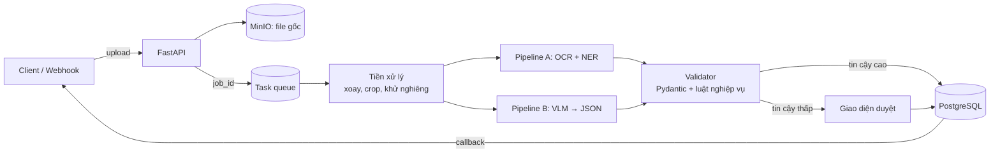

# P04 — Vietnamese Document AI (hóa đơn/chứng từ → JSON có kiểm chứng)

> Nền tảng nhận **ảnh chụp/PDF hóa đơn, biên lai, chứng từ tiếng Việt** → trả về **JSON có cấu trúc** (người bán, mã số thuế, ngày, danh sách mặt hàng, tổng tiền…) kèm **độ tin cậy từng trường**; trường nào không chắc thì chuyển cho người duyệt (human-in-the-loop).
> Đây là bài toán doanh nghiệp VN (ngân hàng, bảo hiểm, kế toán, logistics) đang trả tiền để giải quyết → dự án "đinh" cho CV.

| Mục | Chi tiết |
|---|---|
| Hướng | Computer Vision + NLP + Backend |
| Độ khó | ⭐⭐⭐⭐ |
| Thời gian | 5–6 tuần |
| Bài học áp dụng | [07 ConvNets](https://github.com/microsoft/AI-For-Beginners/tree/main/lessons/4-ComputerVision/07-ConvNets), [16 RNN](https://github.com/microsoft/AI-For-Beginners/tree/main/lessons/5-NLP/16-RNN) (CRNN/CTC trong OCR), [18 Transformers](https://github.com/microsoft/AI-For-Beginners/tree/main/lessons/5-NLP/18-Transformers), [19 NER](https://github.com/microsoft/AI-For-Beginners/tree/main/lessons/5-NLP/19-NER), [X1 MultiModal](https://github.com/microsoft/AI-For-Beginners/tree/main/lessons/X-Extras/X1-MultiModal) |
| Vị trí phù hợp | AI Engineer, CV/OCR Engineer, Backend Engineer (fintech) |

---

## 1. Hai cách tiếp cận — hãy làm **cả hai** và so sánh

| Pipeline cổ điển | Pipeline VLM (2025–2026) |
|---|---|
| Phát hiện vùng chữ → OCR từng dòng (VietOCR) → trích trường bằng NER/regex/LayoutLM | Đưa ảnh vào Vision-Language Model (Qwen3-VL, Vintern, PaddleOCR-VL, DeepSeek-OCR…) → sinh JSON theo schema |
| Nhanh, rẻ, dễ kiểm soát, cần nhiều công gán nhãn | Ít code, tổng quát tốt, chậm/tốn GPU hơn, có thể "bịa" (hallucinate) |

Kết quả so sánh (accuracy từng trường × latency × chi phí) chính là phần giá trị nhất để kể với nhà tuyển dụng.

## 2. Kiến trúc

## 3. Tech stack

OpenCV · PaddleOCR (detect) · VietOCR (recognize) · Qwen3-VL / Vintern / PaddleOCR-VL (VLM) · vLLM hoặc Ollama để serve VLM · FastAPI · Celery/Arq · PostgreSQL · MinIO · Pydantic · Label Studio · Docker Compose

## 4. Kiến thức cần nắm

### CV / OCR
- [ ] Tiền xử lý ảnh chụp điện thoại: phát hiện 4 góc tài liệu, perspective transform, khử nghiêng, tăng tương phản
- [ ] Text detection (DB/DBNet) vs. text recognition (CRNN + CTC, Transformer OCR)
- [ ] Đặc thù tiếng Việt: dấu thanh, font hóa đơn nhiệt mờ → metric **CER/WER**
- [ ] Layout: bảng mặt hàng (table structure recognition), key–value pairs

### NLP / VLM
- [ ] NER/key-information extraction; mô hình layout-aware (LayoutLM family) — đọc thêm
- [ ] Prompt VLM với **JSON schema**, constrained decoding / structured output
- [ ] Fine-tune VLM nhỏ bằng LoRA trên vài trăm mẫu ([Unsloth](https://github.com/unslothai/unsloth) / [LlamaFactory](https://github.com/hiyouga/LlamaFactory))
- [ ] Ước lượng độ tin cậy: xác suất token, đồng thuận giữa 2 pipeline, kiểm tra chéo (tổng dòng = tổng tiền, định dạng MST, ngày hợp lệ)

### Backend
- [ ] API bất đồng bộ: `POST /documents` → `202 Accepted + job_id`; `GET /documents/{id}`; webhook callback khi xong
- [ ] Idempotency key khi client gửi lại cùng file
- [ ] Lưu trữ file có presigned URL; xóa theo chính sách lưu giữ
- [ ] Giao diện review: hiển thị ảnh + bounding box + trường cần sửa; ghi lại chỉnh sửa → dữ liệu fine-tune (data flywheel)
- [ ] Bảo mật dữ liệu: chứng từ có thông tin nhạy cảm → mã hóa at-rest, phân quyền

## 5. Lộ trình

| Tuần | Milestone |
|---|---|
| 1 | Thu thập & gán nhãn ~200 hóa đơn; định nghĩa schema JSON + metric (exact match từng trường) |
| 2 | Pipeline A (PaddleOCR + VietOCR + luật/NER); đo CER + field accuracy |
| 3 | Pipeline B (VLM zero-shot); bảng so sánh A vs B |
| 4 | Backend async + MinIO + validator + callback |
| 5 | Giao diện human-in-the-loop, logging chỉnh sửa |
| 6 | Fine-tune VLM nhỏ bằng dữ liệu đã sửa; đo lại; viết blog |

## 6. Dữ liệu

- Hóa đơn tiếng Việt: MC-OCR 2021 (RIVF challenge, biên lai VN) — có bản mirror **không chính thức** trên Hugging Face: [tqhuyen/MC_OCR2021](https://huggingface.co/datasets/tqhuyen/MC_OCR2021) (kiểm tra điều khoản trước khi dùng).
- Tiếng Anh để đối chiếu: [CORD](https://github.com/clovaai/cord) (biên lai), [FUNSD](https://guillaumejaume.github.io/FUNSD/) (form), SROIE (ICDAR 2019).
- Tự thu thập hóa đơn của chính bạn/bạn bè (che thông tin cá nhân) → dữ liệu thật.

## 7. Repo / model tham khảo

| Repo | Ghi chú |
|---|---|
| [PaddlePaddle/PaddleOCR](https://github.com/PaddlePaddle/PaddleOCR) | Detect + recognize + PaddleOCR-VL (document parsing) |
| [pbcquoc/vietocr](https://github.com/pbcquoc/vietocr) | OCR tiếng Việt (Transformer/Seq2Seq) |
| [mindee/doctr](https://github.com/mindee/doctr) | OCR end-to-end, code sạch để học |
| [opendatalab/MinerU](https://github.com/opendatalab/MinerU) · [docling-project/docling](https://github.com/docling-project/docling) | Chuyển PDF → Markdown/JSON |
| [deepseek-ai/DeepSeek-OCR](https://github.com/deepseek-ai/DeepSeek-OCR) | OCR bằng "nén ngữ cảnh quang học" |
| [QwenLM/Qwen3-VL](https://github.com/QwenLM/Qwen3-VL) | VLM đa ngôn ngữ mạnh |
| [5CD-AI/Vintern-1B-v3_5](https://huggingface.co/5CD-AI/Vintern-1B-v3_5) | VLM nhỏ cho tiếng Việt (chạy được trên GPU Colab) |
| [HumanSignal/label-studio](https://github.com/HumanSignal/label-studio) | Gán nhãn |
| [pydantic/pydantic](https://github.com/pydantic/pydantic) | Schema + validation |

## 8. Bài báo liên quan

LLaVA, Qwen3-VL, **DeepSeek-OCR**, **PaddleOCR-VL / PaddleOCR-VL-1.6 (2026)**, MinerU2.5, SmolDocling, Vintern-1B, *Unlimited OCR Works* (2026) — xem [01-Computer-Vision.md](../../Research-Papers/01-Computer-Vision.md).

## 9. Trình bày trên CV

- Bảng: pipeline × (field accuracy, CER, latency/trang, chi phí GPU/1000 trang).
- *"Built an async document-extraction service for Vietnamese receipts combining OCR (PaddleOCR+VietOCR) and a VLM fallback with schema validation and human review; field-level accuracy __%, __ s/page; review-driven LoRA fine-tuning improved accuracy by __ pts."*

## 10. Mở rộng / nghiên cứu

- Benchmark nhỏ: VLM mã nguồn mở trên chứng từ tiếng Việt (ý tưởng trong [06-Research-Ideas.md](../../Research-Papers/06-Research-Ideas.md)).
- Chat với tài liệu (nối sang P02): hỏi "tháng này tôi chi bao nhiêu cho ăn uống?".
