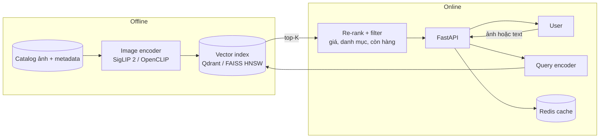

# P05 — Visual Search Engine (tìm sản phẩm bằng ảnh hoặc bằng câu mô tả)

> Search engine cho catalog sản phẩm thời trang: người dùng **tải ảnh** ("tìm áo giống cái này") hoặc **gõ mô tả** ("váy hoa nhí màu xanh đi biển") → trả về sản phẩm tương tự trong < 100 ms trên hàng chục nghìn ảnh.
> Ứng dụng trực tiếp kiến thức **CLIP / multimodal embeddings** trong khóa học; là bài toán thật của Shopee, Tiki, Lazada…

| Mục | Chi tiết |
|---|---|
| Hướng | Computer Vision + Backend (search) |
| Độ khó | ⭐⭐⭐ |
| Thời gian | 3–4 tuần |
| Bài học áp dụng | [14 Embeddings](https://github.com/microsoft/AI-For-Beginners/tree/main/lessons/5-NLP/14-Embeddings), [X1 MultiModal (CLIP)](https://github.com/microsoft/AI-For-Beginners/tree/main/lessons/X-Extras/X1-MultiModal), [08 Transfer Learning](https://github.com/microsoft/AI-For-Beginners/tree/main/lessons/4-ComputerVision/08-TransferLearning) |
| Vị trí phù hợp | ML Engineer (Search/Recommendation), Backend Engineer, CV Engineer |

---

## 1. Kiến trúc

## 2. Tech stack

OpenCLIP / SigLIP 2 (Hugging Face) · FAISS hoặc Qdrant/Milvus · FastAPI · PostgreSQL (metadata) · Redis · Gradio/React UI · Docker

## 3. Kiến thức cần nắm

### AI
- [ ] Contrastive learning (CLIP loss vs. SigLIP sigmoid loss) — hiểu tại sao ảnh và chữ nằm cùng không gian vector
- [ ] Chuẩn hóa vector, cosine similarity, chọn chiều embedding
- [ ] Zero-shot vs. fine-tune (contrastive fine-tune trên cặp ảnh–mô tả sản phẩm)
- [ ] Query tiếng Việt: encoder đa ngôn ngữ (SigLIP 2 hỗ trợ đa ngôn ngữ) hoặc dịch query → so sánh
- [ ] Metric retrieval: Recall@K, mAP, NDCG, MRR; tạo tập truy vấn đánh giá

### Search / Backend
- [ ] ANN: brute-force vs. IVF vs. **HNSW** (đánh đổi recall ↔ latency ↔ RAM); product quantization
- [ ] Hybrid: vector + filter metadata (giá, size) — pre-filter vs. post-filter
- [ ] Batch indexing hàng chục nghìn ảnh (GPU Colab) → lưu index; cập nhật tăng dần khi thêm sản phẩm
- [ ] Pagination, caching kết quả truy vấn phổ biến, đo p95 latency
- [ ] Đánh giá online giả lập: log click → CTR

## 4. Lộ trình

| Tuần | Milestone |
|---|---|
| 1 | Embed toàn bộ catalog bằng OpenCLIP + SigLIP 2; notebook tìm kiếm brute-force |
| 2 | FAISS/Qdrant + FastAPI + UI; tìm bằng ảnh và bằng text |
| 3 | Tập đánh giá 100–200 truy vấn; bảng Recall@10 theo model × loại index |
| 4 | Filter metadata, cache, load test, (tùy chọn) fine-tune contrastive |

## 5. Dữ liệu

- [Fashion Product Images Dataset — Kaggle](https://www.kaggle.com/datasets/paramaggarwal/fashion-product-images-dataset) (~44k sản phẩm có ảnh + thuộc tính).
- [H&M Personalized Fashion Recommendations — Kaggle](https://www.kaggle.com/competitions/h-and-m-personalized-fashion-recommendations) (ảnh + lịch sử mua → nối sang P11).

## 6. Repo / model tham khảo

| Repo | Ghi chú |
|---|---|
| [openai/CLIP](https://github.com/openai/CLIP) | CLIP gốc |
| [mlfoundations/open_clip](https://github.com/mlfoundations/open_clip) | CLIP mã nguồn mở, nhiều checkpoint |
| [google/siglip2-base-patch16-224](https://huggingface.co/google/siglip2-base-patch16-224) | SigLIP 2 (đa ngôn ngữ) |
| [facebookresearch/faiss](https://github.com/facebookresearch/faiss) | Thư viện ANN kinh điển |
| [qdrant/qdrant](https://github.com/qdrant/qdrant) · [milvus-io/milvus](https://github.com/milvus-io/milvus) | Vector database |

## 7. Bài báo liên quan

CLIP, SigLIP, **SigLIP 2**, Perception Encoder, DINOv2/**DINOv3**, FAISS, HNSW, *ViCLIP-OT* (CLIP cho tiếng Việt, 2026) — xem [01-Computer-Vision.md](../../Research-Papers/01-Computer-Vision.md) và [04-ML-Systems-MLOps-RecSys.md](../../Research-Papers/04-ML-Systems-MLOps-RecSys.md).

## 8. Trình bày trên CV

- *"Built a multimodal (image/text) product search over __k items using SigLIP 2 embeddings and HNSW index: Recall@10 __%, p95 latency __ ms; compared OpenCLIP vs SigLIP 2 and IVF vs HNSW trade-offs."*

## 9. Mở rộng

- Truy vấn kết hợp: ảnh + chữ ("giống áo này nhưng màu đỏ") — composed image retrieval.
- Dùng DINOv3 (thuần thị giác) cho "tìm ảnh gần như trùng", CLIP cho "tìm theo ngữ nghĩa" → so sánh.
