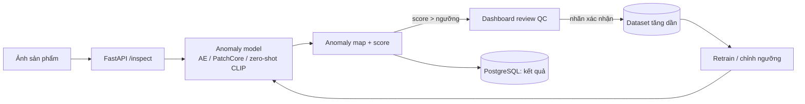

# P06 — Industrial Defect Detection (phát hiện lỗi sản phẩm không cần ảnh lỗi)

> Hệ thống kiểm tra chất lượng bằng hình ảnh: chỉ **học từ ảnh sản phẩm bình thường**, tự khoanh vùng vết xước, nứt, thiếu linh kiện… trên ảnh mới. Kèm **dashboard duyệt lỗi** cho kỹ sư QC và vòng lặp cải thiện model.
> Ứng dụng trực tiếp bài **Autoencoders** (tái tạo ảnh bình thường → vùng tái tạo kém = bất thường). Làm hoàn toàn trên dataset công khai, **không cần dây chuyền/camera thật**.

| Mục | Chi tiết |
|---|---|
| Hướng | Computer Vision + Backend |
| Độ khó | ⭐⭐⭐ |
| Thời gian | 3–5 tuần |
| Bài học áp dụng | [09 Autoencoders](https://github.com/microsoft/AI-For-Beginners/tree/main/lessons/4-ComputerVision/09-Autoencoders), [12 Segmentation](https://github.com/microsoft/AI-For-Beginners/tree/main/lessons/4-ComputerVision/12-Segmentation), [10 GANs](https://github.com/microsoft/AI-For-Beginners/tree/main/lessons/4-ComputerVision/10-GANs) (sinh ảnh lỗi giả) |
| Vị trí phù hợp | CV Engineer (sản xuất/điện tử — nhiều nhà máy FDI tại VN), ML Engineer |

---

## 1. Kiến trúc

## 2. Kiến thức cần nắm

### AI
- [ ] Bài toán **one-class / unsupervised anomaly detection**, vì sao không dùng classifier thông thường
- [ ] Baseline 1 — Convolutional Autoencoder: reconstruction error làm anomaly map (tự code từ bài 09)
- [ ] Baseline 2 — PatchCore: memory bank đặc trưng patch từ backbone pretrained + kNN
- [ ] Zero/few-shot: WinCLIP, AnomalyCLIP (dùng CLIP + prompt "a photo of a damaged …")
- [ ] Metric: image-level AUROC, pixel-level AUROC, **PRO**; chọn ngưỡng theo mục tiêu (bỏ sót lỗi vs. báo động giả)
- [ ] Sinh lỗi giả (synthetic anomalies: CutPaste, GAN) để tăng dữ liệu
- [ ] Tối ưu: export OpenVINO/ONNX, chạy CPU

### Backend
- [ ] API nhận ảnh → trả score + heatmap (PNG/base64) + bbox vùng lỗi
- [ ] Dashboard review (Streamlit/React): lọc theo score, xác nhận/bác bỏ, thống kê tỉ lệ lỗi theo ngày
- [ ] Lưu version model + ngưỡng; audit log mỗi quyết định

## 3. Lộ trình

| Tuần | Milestone |
|---|---|
| 1 | Tự code Autoencoder trên 1–2 category MVTec AD; đo AUROC |
| 2 | Chạy PatchCore bằng anomalib trên toàn bộ MVTec AD; bảng so sánh với AE |
| 3 | Zero-shot (WinCLIP/AnomalyCLIP) — cần bao nhiêu ảnh bình thường là đủ? |
| 4–5 | API + dashboard review + vòng lặp retrain; viết blog |

## 4. Dữ liệu

- [MVTec AD](https://www.mvtec.com/company/research/datasets/mvtec-ad) — 15 loại vật thể/bề mặt, có mask lỗi (license phi thương mại).
- VisA — [amazon-science/spot-diff](https://github.com/amazon-science/spot-diff).

## 5. Repo tham khảo

| Repo | Ghi chú |
|---|---|
| [open-edge-platform/anomalib](https://github.com/open-edge-platform/anomalib) | Thư viện anomaly detection đầy đủ (PatchCore, PaDiM, EfficientAD…), Apache-2.0 |
| [zqhang/AnomalyCLIP](https://github.com/zqhang/AnomalyCLIP) | Zero-shot anomaly detection |
| [HumanSignal/label-studio](https://github.com/HumanSignal/label-studio) | Gán/duyệt nhãn |

## 6. Bài báo liên quan

Autoencoder/VAE, MAE, PatchCore, WinCLIP, AnomalyCLIP, DINOv3, *LiZAD (2026)* — xem [01-Computer-Vision.md](../../Research-Papers/01-Computer-Vision.md).

## 7. Trình bày trên CV

- *"Implemented and benchmarked unsupervised defect detection (conv-AE vs PatchCore vs zero-shot CLIP) on MVTec AD — image AUROC __ / __ / __; shipped a FastAPI inspection service with QC review dashboard and threshold versioning."*

## 8. Mở rộng / nghiên cứu

- So sánh backbone DINOv2 vs DINOv3 cho PatchCore (ít ai làm kỹ → có thể thành báo cáo ngắn).
- Few-shot: chỉ 1–8 ảnh bình thường mỗi loại.
