# P07 — VN Quant Research Platform (dữ liệu → factor → mô hình → backtest)

> Xây **nền tảng nghiên cứu định lượng mini cho thị trường chứng khoán Việt Nam**: pipeline dữ liệu tự động hằng ngày, thư viện factor, huấn luyện mô hình dự báo lợi suất, **backtest trung thực** (phí, thuế, biên độ, T+2), dashboard kết quả.
> Đây là "hạ tầng" mà P08, P09, P10 sẽ dùng lại → làm tốt P07 là bạn có cả một hệ sinh thái Quant trên GitHub.

| Mục | Chi tiết |
|---|---|
| Hướng | Quant + Data Engineering + Backend |
| Độ khó | ⭐⭐⭐⭐ |
| Thời gian | 6–8 tuần |
| Bài học áp dụng | [05 Frameworks](https://github.com/microsoft/AI-For-Beginners/tree/main/lessons/3-NeuralNetworks/05-Frameworks), [16 RNN (LSTM/GRU)](https://github.com/microsoft/AI-For-Beginners/tree/main/lessons/5-NLP/16-RNN), [18 Transformers](https://github.com/microsoft/AI-For-Beginners/tree/main/lessons/5-NLP/18-Transformers) |
| Vị trí phù hợp | Quant Developer, Quant Researcher (junior), Data Engineer (fintech), Backend (trading systems) |

> ⚠️ Mục đích học tập & nghiên cứu, **không phải khuyến nghị đầu tư**.

---

## 1. Kiến trúc

```mermaid
flowchart LR
    SRC[Nguồn dữ liệu<br/>vnstock, báo cáo tài chính] --> ETL[ETL hằng ngày<br/>Prefect / Airflow]
    ETL --> RAW[(Parquet raw)]
    RAW --> CLEAN[Làm sạch:<br/>điều chỉnh cổ tức/chia tách,<br/>mã hủy niêm yết]
    CLEAN --> WH[(DuckDB / TimescaleDB)]
    WH --> FS[Factor library<br/>momentum, value, volatility, liquidity…]
    FS --> ML[Mô hình: LightGBM, LSTM,<br/>Transformer, TS foundation models]
    ML --> BT[Backtest engine<br/>walk-forward, phí, thuế, biên độ, T+2]
    BT --> REP[Báo cáo: IC, Sharpe, drawdown,<br/>Deflated Sharpe, PBO]
    REP --> API[FastAPI] --> DASH[Dashboard]
```

## 2. Kiến thức cần nắm

### Tài chính & thị trường VN
- [ ] Lợi suất log vs. đơn, điều chỉnh giá (cổ tức, chia tách, phát hành thêm)
- [ ] Đặc thù VN (kiểm tra lại quy định hiện hành trước khi code): biên độ giá theo sàn (HOSE/HNX/UPCoM khác nhau), chu kỳ thanh toán T+2, lô giao dịch, phí môi giới, thuế khi bán, room ngoại
- [ ] Factor investing: momentum, reversal, value (P/E, P/B), size, volatility thấp, thanh khoản
- [ ] Đánh giá factor: **IC / Rank IC / ICIR**, danh mục theo quintile, long-only vs. long-short, turnover
- [ ] Metric chiến lược: CAGR, volatility, Sharpe, Sortino, max drawdown, Calmar

### Thống kê & chống overfitting (quan trọng nhất!)
- [ ] **Look-ahead bias** (dùng thông tin tương lai, ví dụ BCTC công bố muộn hơn kỳ báo cáo)
- [ ] **Survivorship bias** (chỉ lấy mã còn niêm yết hôm nay)
- [ ] Walk-forward validation, **purged/embargoed cross-validation**
- [ ] Multiple testing: thử 100 chiến lược thì chắc chắn có cái "đẹp" → **Deflated Sharpe Ratio**, **Probability of Backtest Overfitting** (xem [03-Quant-Finance-TimeSeries.md](../../Research-Papers/03-Quant-Finance-TimeSeries.md))
- [ ] Kiểm định: t-stat của alpha, bootstrap

### Machine Learning
- [ ] Gradient boosting (LightGBM) làm baseline mạnh cho dữ liệu dạng bảng
- [ ] LSTM/GRU, Transformer cho chuỗi; so với baseline đơn giản (DLinear, random walk)
- [ ] Time-series foundation models zero-shot: Chronos-2, TimesFM, Kronos → có thực sự hơn random walk? (nghiên cứu 2026 cho thấy lợi thế rất nhỏ — xem paper 2606.27100)
- [ ] Cross-sectional ranking loss vs. regression loss

### Data Engineering / Backend
- [ ] ETL idempotent, chạy lại được theo ngày; kiểm tra chất lượng dữ liệu (thiếu phiên, giá âm, nhảy bất thường)
- [ ] Lưu trữ cột (Parquet) + truy vấn DuckDB; hoặc TimescaleDB hypertable
- [ ] Orchestration: [Prefect](https://github.com/PrefectHQ/prefect) / [Airflow](https://github.com/apache/airflow), retry, alert
- [ ] Backtest engine vectorized (nhanh) vs. event-driven (sát thực tế) — viết engine đơn giản của riêng bạn trước
- [ ] API trả tín hiệu/báo cáo, cache kết quả backtest

## 3. Lộ trình

| Tuần | Milestone |
|---|---|
| 1–2 | ETL giá + BCTC toàn thị trường (bao gồm mã đã hủy niêm yết nếu lấy được), kiểm tra chất lượng, lưu Parquet/DuckDB |
| 3 | Thư viện 15–20 factor + báo cáo IC/quintile |
| 4 | Backtest engine có phí, thuế, biên độ, T+2; so với VN-Index |
| 5–6 | LightGBM → LSTM → Transformer → TSFM zero-shot; walk-forward; bảng so sánh |
| 7 | Deflated Sharpe + PBO cho toàn bộ thử nghiệm; dashboard |
| 8 | Viết báo cáo nghiên cứu ngắn (có phần "những gì KHÔNG hiệu quả") |

## 4. Dữ liệu

- [thinh-vu/vnstock](https://github.com/thinh-vu/vnstock) — thư viện Python lấy dữ liệu chứng khoán VN. **Lưu ý license**: miễn phí cho cá nhân/học tập/nghiên cứu, không phải giấy phép OSI, và **không cấp quyền dữ liệu của nguồn bên thứ ba** → không phân phối lại dữ liệu thô trên GitHub.
- [ranaroussi/yfinance](https://github.com/ranaroussi/yfinance) — dữ liệu thị trường quốc tế để đối chiếu.

## 5. Repo tham khảo

| Repo | Ghi chú |
|---|---|
| [microsoft/qlib](https://github.com/microsoft/qlib) | Nền tảng quant AI của Microsoft — học kiến trúc (data handler, model zoo, backtest) |
| [microsoft/RD-Agent](https://github.com/microsoft/RD-Agent) | Agent tự động nghiên cứu factor/model (R&D-Agent-Quant) |
| [stefan-jansen/machine-learning-for-trading](https://github.com/stefan-jansen/machine-learning-for-trading) | Sách + notebook ML4T rất đầy đủ |
| [polakowo/vectorbt](https://github.com/polakowo/vectorbt) · [kernc/backtesting.py](https://github.com/kernc/backtesting.py) | Backtest |
| [lightgbm-org/LightGBM](https://github.com/lightgbm-org/LightGBM) | Baseline gradient boosting |
| [thuml/Time-Series-Library](https://github.com/thuml/Time-Series-Library) | Model zoo time series (PatchTST, iTransformer, TimesNet…) |
| [Nixtla/statsforecast](https://github.com/Nixtla/statsforecast) · [Nixtla/neuralforecast](https://github.com/Nixtla/neuralforecast) | Baseline thống kê & neural |
| [amazon-science/chronos-forecasting](https://github.com/amazon-science/chronos-forecasting) · [google-research/timesfm](https://github.com/google-research/timesfm) · [shiyu-coder/Kronos](https://github.com/shiyu-coder/Kronos) | Time-series foundation models |
| [duckdb/duckdb](https://github.com/duckdb/duckdb) · [timescale/timescaledb](https://github.com/timescale/timescaledb) | Lưu trữ/truy vấn |

## 6. Bài báo liên quan

Gu–Kelly–Xiu (2020), Harvey–Liu–Zhu (2016), Deflated Sharpe Ratio, Probability of Backtest Overfitting, Qlib, DLinear, PatchTST, Chronos/Chronos-2, TimesFM, Kronos, *Pretrained TSFMs for Financial Return Forecasting* (2026) — xem [03-Quant-Finance-TimeSeries.md](../../Research-Papers/03-Quant-Finance-TimeSeries.md).

## 7. Trình bày trên CV

- *"Built an end-to-end quant research platform for Vietnamese equities: daily ETL (Prefect, DuckDB), 20-factor library, walk-forward ML models (LightGBM/LSTM/TSFM), and a cost-aware backtester with Deflated Sharpe & PBO diagnostics."*
- Trình bày **trung thực**: báo cáo cả chiến lược thất bại → nhà tuyển dụng quant đánh giá cao tư duy chống overfitting hơn một đường equity curve đẹp.

## 8. Mở rộng

- Tái lập Gu–Kelly–Xiu (2020) trên thị trường VN (ý tưởng nghiên cứu trong [06-Research-Ideas.md](../../Research-Papers/06-Research-Ideas.md)).
- Thêm dữ liệu tin tức (P09), ảnh biểu đồ (P08), RL phân bổ vốn (P10).
