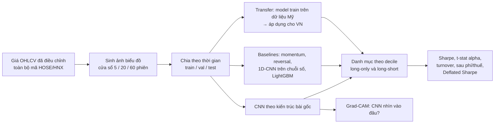

# P08 — Chart-Image CNN: tái lập *(Re-)Imag(in)ing Price Trends* trên thị trường Việt Nam

> **Dự án nghiên cứu** kết hợp đúng 2 sở thích của bạn: **Computer Vision + Quant**.
> Bài gốc: Jiang, Kelly & Xiu, *"(Re-)Imag(in)ing Price Trends"*, **The Journal of Finance** (2023) — [DOI 10.1111/jofi.13268](https://doi.org/10.1111/jofi.13268). Ý tưởng: vẽ dữ liệu giá (OHLC, đường trung bình, khối lượng) thành **ảnh đen–trắng**, cho CNN "nhìn" biểu đồ như một nhà phân tích kỹ thuật để dự báo xác suất tăng giá, rồi đánh giá qua danh mục đầu tư.
> Câu hỏi nghiên cứu của bạn: **Kết quả này có giữ được ở một thị trường cận biên, nhiều nhà đầu tư cá nhân, có biên độ giá như Việt Nam không?** → đủ chất lượng cho một đề tài NCKH sinh viên / workshop paper.

| Mục | Chi tiết |
|---|---|
| Hướng | Nghiên cứu CV × Quant |
| Độ khó | ⭐⭐⭐⭐ |
| Thời gian | 6–10 tuần |
| Bài học áp dụng | [07 ConvNets](https://github.com/microsoft/AI-For-Beginners/tree/main/lessons/4-ComputerVision/07-ConvNets), [08 Transfer Learning](https://github.com/microsoft/AI-For-Beginners/tree/main/lessons/4-ComputerVision/08-TransferLearning), [16 RNN](https://github.com/microsoft/AI-For-Beginners/tree/main/lessons/5-NLP/16-RNN) (baseline chuỗi) |
| Phụ thuộc | Dùng pipeline dữ liệu + backtest của [P07](../P07-VN-Quant-Research-Platform/README.md) |
| Vị trí phù hợp | Quant Researcher, ML Researcher, học lên cao học |

---

## 1. Thiết kế nghiên cứu

### Các câu hỏi nghiên cứu gợi ý (chọn 2–3)
1. **Replication**: CNN trên ảnh có tạo ra chênh lệch lợi suất giữa decile cao/thấp ở VN không, sau phí và thuế?
2. **Ảnh có cần thiết không?** Cùng thông tin, ảnh vs. chuỗi số (1D-CNN/LSTM) vs. LightGBM — cái nào tốt hơn?
3. **Transfer learning xuyên thị trường**: model học trên dữ liệu Mỹ áp vào VN có hiệu quả? (bài gốc có thử nghiệm quốc tế)
4. **Backbone hiện đại**: CNN nhỏ của bài gốc vs. ResNet/ViT/DINOv3-features — lớn hơn có tốt hơn trên dữ liệu nhiễu?
5. **Biên độ giá**: các phiên chạm trần/sàn ảnh hưởng thế nào đến tín hiệu?
6. **So với foundation model K-line** (Kronos, 2025) trên cùng tập test.

## 2. Kiến thức cần nắm

### CV / DL
- [ ] Sinh ảnh hiệu quả (NumPy vẽ trực tiếp pixel thay vì matplotlib → nhanh hơn hàng trăm lần) — hàng trăm nghìn ảnh
- [ ] CNN cho ảnh nhị phân nhỏ, batch norm, dropout, early stopping, ensemble nhiều seed
- [ ] Class imbalance, calibration xác suất
- [ ] Grad-CAM / saliency để diễn giải

### Quant / Thống kê
- [ ] Chia dữ liệu theo **thời gian** (không shuffle!), tránh rò rỉ giữa train/test do cửa sổ chồng lấn
- [ ] Danh mục decile equal-weighted vs. value-weighted, rebalancing, turnover
- [ ] Hồi quy alpha lên các factor (market, size, value, momentum) — Newey-West t-stat
- [ ] Multiple testing & Deflated Sharpe (rất quan trọng khi thử nhiều biến thể)

### Viết nghiên cứu
- [ ] Cấu trúc paper: Introduction → Related Work → Data → Method → Results → Robustness → Conclusion
- [ ] Viết bằng LaTeX (Overleaf), quản lý trích dẫn bằng Zotero
- [ ] Reproducibility: seed, config YAML, script chạy lại toàn bộ bảng/hình

## 3. Lộ trình

| Tuần | Milestone |
|---|---|
| 1–2 | Đọc kỹ bài gốc + 1 repo replication; tái lập trên một tập nhỏ dữ liệu Mỹ để kiểm tra code đúng |
| 3–4 | Sinh ảnh cho toàn bộ cổ phiếu VN; train CNN 20 ngày → 5/20 ngày |
| 5–6 | Baselines + danh mục + bảng kết quả chính |
| 7–8 | Robustness (phí, thanh khoản, giai đoạn), Grad-CAM, transfer learning |
| 9–10 | Viết báo cáo/paper; nộp NCKH sinh viên hoặc workshop |

## 4. Repo tham khảo (bản tái lập độc lập — hãy đọc code, đối chiếu với bài gốc)

| Repo | Ghi chú |
|---|---|
| [George-hardworking/reimaging-price-trends-replication-and-extension](https://github.com/George-hardworking/reimaging-price-trends-replication-and-extension) | Replication + mở rộng sang thị trường Trung Quốc (A-share), transfer learning — **tham khảo gần nhất với đề tài VN** |
| [lich99/Stock_CNN](https://github.com/lich99/Stock_CNN) | Cài đặt PyTorch |
| [RichardS0268/CNN-for-Trading](https://github.com/RichardS0268/CNN-for-Trading) | Cài đặt + báo cáo |
| [hxLau/IPT-CNN](https://github.com/hxLau/IPT-CNN) | Cài đặt PyTorch |
| [shiyu-coder/Kronos](https://github.com/shiyu-coder/Kronos) | Foundation model cho K-line (để so sánh) |

## 5. Bài báo cần đọc

- Jiang, Kelly & Xiu (2023) *(Re-)Imag(in)ing Price Trends* — bài gốc.
- Gu, Kelly & Xiu (2020) *Empirical Asset Pricing via Machine Learning*.
- Kelly, Malamud & Zhou (2024) *The Virtue of Complexity in Return Prediction*.
- Bailey & López de Prado — *Deflated Sharpe Ratio*; *Probability of Backtest Overfitting*.
- Kronos (2025), *Pretrained TSFMs for Financial Return Forecasting* (2026).
→ Link đầy đủ trong [03-Quant-Finance-TimeSeries.md](../../Research-Papers/03-Quant-Finance-TimeSeries.md).

## 6. Trình bày trên CV

- *"Replicated Jiang–Kelly–Xiu (JF 2023) image-based CNN return prediction on Vietnamese equities (__ stocks, __–__); long-short decile portfolio Sharpe __ before / __ after costs; compared against 1D-CNN, LightGBM and cross-market transfer."*
- Kết quả **âm tính** (không hiệu quả ở VN) vẫn là kết quả khoa học có giá trị nếu phương pháp chặt chẽ.
