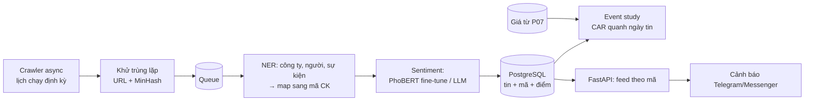

# P09 — Financial News NLP + Event Study (tin tức tiếng Việt → tác động giá)

> Hệ thống thu thập **tin tức tài chính tiếng Việt**, tự động nhận diện **doanh nghiệp/mã cổ phiếu** được nhắc đến (NER), chấm **cảm xúc** (tích cực/tiêu cực), rồi dùng phương pháp **event study** để kiểm chứng: *tin tức có thực sự dự báo được lợi suất bất thường không?*
> Vừa là sản phẩm (feed tin + cảnh báo theo mã), vừa là nghiên cứu (NLP tiếng Việt × tài chính — mảng còn ít công bố).

| Mục | Chi tiết |
|---|---|
| Hướng | NLP + Quant + Backend (crawler, pipeline) |
| Độ khó | ⭐⭐⭐⭐ |
| Thời gian | 5–7 tuần |
| Bài học áp dụng | [13 TextRep](https://github.com/microsoft/AI-For-Beginners/tree/main/lessons/5-NLP/13-TextRep), [14 Embeddings](https://github.com/microsoft/AI-For-Beginners/tree/main/lessons/5-NLP/14-Embeddings), [18 Transformers](https://github.com/microsoft/AI-For-Beginners/tree/main/lessons/5-NLP/18-Transformers), [19 NER](https://github.com/microsoft/AI-For-Beginners/tree/main/lessons/5-NLP/19-NER), [20 LangModels](https://github.com/microsoft/AI-For-Beginners/tree/main/lessons/5-NLP/20-LangModels) |
| Phụ thuộc | Dữ liệu giá từ [P07](../P07-VN-Quant-Research-Platform/README.md) |
| Vị trí phù hợp | NLP Engineer, Quant Researcher, Data Engineer |

> ⚠️ Crawl có trách nhiệm: đọc `robots.txt` và điều khoản của từng trang, giới hạn tốc độ, **không phân phối lại toàn văn bài báo**. Mục đích nghiên cứu, không phải khuyến nghị đầu tư.

---

## 1. Kiến trúc

## 2. Kiến thức cần nắm

### NLP tiếng Việt
- [ ] Tách từ tiếng Việt ([underthesea](https://github.com/undertheseanlp/underthesea)); PhoBERT yêu cầu input đã tách từ
- [ ] Fine-tune [PhoBERT](https://github.com/VinAIResearch/PhoBERT) (`vinai/phobert-base-v2`) cho phân loại cảm xúc
- [ ] Tạo nhãn: tự gán ~1.500–3.000 tiêu đề; hoặc dùng LLM gán nhãn sơ bộ **rồi kiểm tra lại thủ công** một mẫu, đo độ đồng thuận (Cohen's kappa)
- [ ] NER + **entity linking**: "Tập đoàn Hòa Phát", "Hòa Phát", "HPG" → cùng một mã; xây từ điển alias
- [ ] So sánh: TF-IDF + Logistic Regression (baseline) → PhoBERT → LLM zero-shot/few-shot
- [ ] Rủi ro **look-ahead / memorization** của LLM: LLM có thể "nhớ" diễn biến giá sau này → chỉ đánh giá trên dữ liệu **sau** mốc knowledge cutoff của model

### Tài chính / Thống kê
- [ ] Event study: cửa sổ ước lượng, market model, abnormal return (AR), cumulative abnormal return (CAR), kiểm định t
- [ ] Căn thời điểm: tin đăng sau giờ đóng cửa → tác động phiên kế tiếp
- [ ] Danh mục theo sentiment (long tin tốt / short tin xấu — lưu ý thị trường VN hạn chế bán khống → long-only)
- [ ] Hồi quy lợi suất tương lai lên điểm sentiment, kiểm soát các factor

### Backend / Data
- [ ] Crawler async (`httpx` + `asyncio` hoặc Scrapy), retry, rate limit, xoay vòng lịch
- [ ] Trích nội dung chính từ HTML, chuẩn hóa thời gian (múi giờ!)
- [ ] Khử trùng lặp gần đúng (MinHash/LSH) — cùng một tin đăng lại trên nhiều trang
- [ ] Full-text search tiếng Việt trong PostgreSQL hoặc vector search
- [ ] API feed theo mã + webhook/Telegram alert ([python-telegram-bot](https://github.com/python-telegram-bot/python-telegram-bot))

## 3. Lộ trình

| Tuần | Milestone |
|---|---|
| 1 | Crawler 2–3 nguồn, lưu DB, khử trùng lặp; ≥ 6–12 tháng tin lịch sử (nếu nguồn cho phép) |
| 2 | Entity linking tin → mã CK; đo precision trên 200 tin gán tay |
| 3 | Bộ nhãn sentiment + baseline TF-IDF + PhoBERT; bảng F1 |
| 4 | LLM zero/few-shot; so sánh chi phí/độ chính xác |
| 5 | Event study: CAR trung bình theo nhóm sentiment, kiểm định ý nghĩa |
| 6–7 | API + cảnh báo; viết báo cáo nghiên cứu |

## 4. Dữ liệu & model

- [vinai/phobert-base-v2](https://huggingface.co/vinai/phobert-base-v2) — mô hình ngôn ngữ tiếng Việt.
- [takala/financial_phrasebank](https://huggingface.co/datasets/takala/financial_phrasebank) — tập sentiment tài chính tiếng Anh (để đối chiếu / pretrain chéo ngôn ngữ).
- Tin tức: các trang tin tài chính Việt Nam (tuân thủ điều khoản từng trang).

## 5. Repo tham khảo

| Repo | Ghi chú |
|---|---|
| [VinAIResearch/PhoBERT](https://github.com/VinAIResearch/PhoBERT) | PhoBERT |
| [undertheseanlp/underthesea](https://github.com/undertheseanlp/underthesea) | Bộ công cụ NLP tiếng Việt |
| [ProsusAI/finBERT](https://github.com/ProsusAI/finBERT) | FinBERT (tiếng Anh) — tham khảo cách fine-tune cho tài chính |
| [AI4Finance-Foundation/FinGPT](https://github.com/AI4Finance-Foundation/FinGPT) | LLM tài chính mã nguồn mở |
| [TauricResearch/TradingAgents](https://github.com/TauricResearch/TradingAgents) | Multi-agent LLM phân tích tin + giao dịch (đang trending) |

## 6. Bài báo liên quan

FinBERT, BloombergGPT, FinGPT, *Can ChatGPT Forecast Stock Price Movements?*, *Financial Statement Analysis with LLMs*, FNSPID, *The Memorization Problem*, *Detecting Lookahead Bias in LLM Forecasts*, TradingAgents, ViSoBERT — xem [03-Quant-Finance-TimeSeries.md](../../Research-Papers/03-Quant-Finance-TimeSeries.md).

## 7. Trình bày trên CV

- *"Built a Vietnamese financial-news pipeline (async crawler, entity linking to __ tickers, PhoBERT sentiment F1 __) and an event study showing CAR[0,+3] of __% (t = __) for negative news; served ticker-level feeds and alerts via FastAPI + Telegram."*

## 8. Mở rộng / nghiên cứu

- LLM có "nhớ" thị trường VN không? Kiểm tra look-ahead bias trên tin tiếng Việt (ý tưởng trong [06-Research-Ideas.md](../../Research-Papers/06-Research-Ideas.md)).
- Tóm tắt báo cáo tài chính quý bằng LLM + trích chỉ số → factor mới cho P07.
