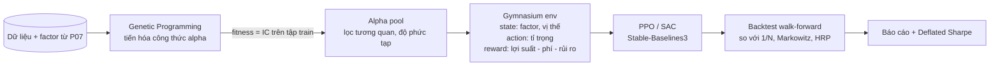

# P10 — RL Portfolio Allocation + Genetic Alpha Mining

> Hai module dùng đúng 2 bài cuối của khóa học:
> 1. **Genetic Programming** (bài 21) tự động "tiến hóa" ra công thức alpha (ví dụ `rank(close/delay(close,5)) * -corr(volume, close, 10)`) từ dữ liệu giá.
> 2. **Deep Reinforcement Learning** (bài 22) học cách **phân bổ vốn** giữa các cổ phiếu/factor theo thời gian, so với Markowitz và chia đều.
> Chạy trên dữ liệu + backtest engine của [P07](../P07-VN-Quant-Research-Platform/README.md).

| Mục | Chi tiết |
|---|---|
| Hướng | Quant + RL + Optimization |
| Độ khó | ⭐⭐⭐⭐ |
| Thời gian | 5–7 tuần |
| Bài học áp dụng | [21 Genetic Algorithms](https://github.com/microsoft/AI-For-Beginners/tree/main/lessons/6-Other/21-GeneticAlgorithms), [22 Deep RL](https://github.com/microsoft/AI-For-Beginners/tree/main/lessons/6-Other/22-DeepRL), [23 Multi-agent](https://github.com/microsoft/AI-For-Beginners/tree/main/lessons/6-Other/23-MultiagentSystems) (mở rộng) |
| Vị trí phù hợp | Quant Researcher, RL Engineer |

> ⚠️ RL trong tài chính **rất dễ overfit** (môi trường không dừng, tín hiệu nhiễu). Mục tiêu là học phương pháp và đo lường trung thực. Không phải khuyến nghị đầu tư.

---

## 1. Kiến trúc

## 2. Kiến thức cần nắm

### Genetic Programming
- [ ] Biểu diễn công thức dạng cây (toán tử: `+ - * /`, `rank`, `delay`, `ts_mean`, `corr`…)
- [ ] Crossover, mutation, selection, bloat control (phạt độ phức tạp)
- [ ] Fitness = Rank IC trên train; **kiểm tra trên validation riêng** → tránh "khai thác nhiễu"
- [ ] Đa dạng hóa alpha: loại bỏ alpha tương quan cao với alpha đã có
- [ ] Đọc thêm: AlphaGen (RL sinh alpha), AlphaAgent/QuantaAlpha (LLM sinh alpha, 2025–2026)

### Reinforcement Learning
- [ ] MDP: state, action, reward, discount; policy gradient, actor-critic
- [ ] PPO, SAC; action liên tục (tỉ trọng) + softmax để tổng = 1, ràng buộc long-only
- [ ] Thiết kế reward: lợi suất sau phí, phạt drawdown/volatility, differential Sharpe
- [ ] Viết môi trường chuẩn [Gymnasium](https://github.com/Farama-Foundation/Gymnasium); vector hóa env để train nhanh
- [ ] Đánh giá: nhiều seed, khoảng tin cậy, walk-forward — không chọn "seed đẹp nhất"

### Tối ưu danh mục cổ điển (baseline bắt buộc)
- [ ] Equal-weight (1/N) — baseline khó đánh bại
- [ ] Mean-variance (Markowitz), minimum variance, risk parity, HRP
- [ ] Ước lượng hiệp phương sai co rút (Ledoit-Wolf)

### Engineering
- [ ] Cấu hình thí nghiệm bằng YAML, tracking bằng MLflow, chạy song song nhiều seed
- [ ] Unit test cho env (reward, phí, ràng buộc) — bug trong env = kết quả vô nghĩa

## 3. Lộ trình

| Tuần | Milestone |
|---|---|
| 1 | Baselines 1/N, Markowitz, HRP trên rổ VN30 (dùng dữ liệu P07) |
| 2–3 | GP alpha mining ([gplearn](https://github.com/trevorstephens/gplearn) hoặc tự viết với [DEAP](https://github.com/DEAP/deap)); đánh giá out-of-sample |
| 4–5 | Gymnasium env + PPO/SAC; so sánh với baselines, nhiều seed |
| 6–7 | Deflated Sharpe cho toàn bộ thử nghiệm; báo cáo |

## 4. Repo tham khảo

| Repo | Ghi chú |
|---|---|
| [AI4Finance-Foundation/FinRL](https://github.com/AI4Finance-Foundation/FinRL) | Framework DRL cho giao dịch — tham khảo cấu trúc env |
| [DLR-RM/stable-baselines3](https://github.com/DLR-RM/stable-baselines3) | PPO/SAC chuẩn |
| [Farama-Foundation/Gymnasium](https://github.com/Farama-Foundation/Gymnasium) | API môi trường RL |
| [trevorstephens/gplearn](https://github.com/trevorstephens/gplearn) · [DEAP/deap](https://github.com/DEAP/deap) | Genetic programming |
| [ICT-FinD-Lab/alphagen](https://github.com/ICT-FinD-Lab/alphagen) | Code của AlphaGen (KDD 2023) |
| [PyPortfolio/PyPortfolioOpt](https://github.com/PyPortfolio/PyPortfolioOpt) · [dcajasn/Riskfolio-Lib](https://github.com/dcajasn/Riskfolio-Lib) | Tối ưu danh mục cổ điển |
| [microsoft/qlib](https://github.com/microsoft/qlib) | Có module RL cho thực thi lệnh |

## 5. Bài báo liên quan

DQN, PPO, A3C (ICML 2026 Test of Time), FinRL, Deep Hedging, *Deep Learning for Portfolio Optimization*, AlphaGen, AlphaAgent, QuantaAlpha, R&D-Agent-Quant — xem [00-Foundations-Classics.md](../../Research-Papers/00-Foundations-Classics.md) và [03-Quant-Finance-TimeSeries.md](../../Research-Papers/03-Quant-Finance-TimeSeries.md).

## 6. Trình bày trên CV

- *"Implemented genetic-programming alpha mining and a PPO portfolio-allocation agent in a custom Gymnasium env with transaction costs; benchmarked against 1/N, Markowitz and HRP over walk-forward windows with Deflated Sharpe diagnostics."*
