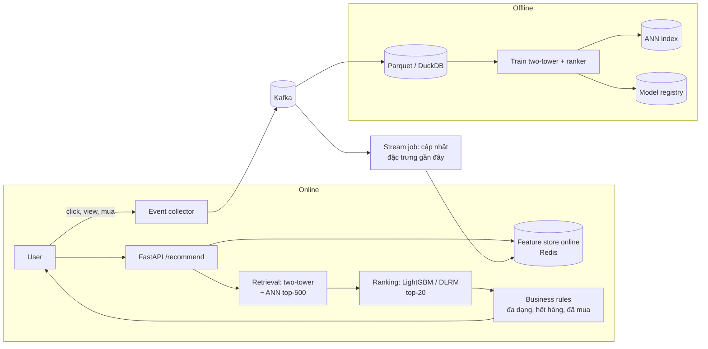

# P11 — Real-time Recommender System (kiến trúc e-commerce thật)

> Hệ gợi ý sản phẩm 2 tầng **retrieval → ranking** giống kiến trúc của các sàn TMĐT: học embedding người dùng & sản phẩm (two-tower), truy xuất ứng viên bằng ANN, xếp hạng bằng model giàu đặc trưng, **cập nhật theo hành vi gần như thời gian thực** qua Kafka, đánh giá offline + A/B test giả lập.
> Hướng đi "khác" nhưng có **nhu cầu tuyển dụng rất lớn** cho Backend + AI.

| Mục | Chi tiết |
|---|---|
| Hướng | RecSys + Backend (streaming, low-latency) |
| Độ khó | ⭐⭐⭐⭐ |
| Thời gian | 6–8 tuần |
| Bài học áp dụng | [14 Embeddings](https://github.com/microsoft/AI-For-Beginners/tree/main/lessons/5-NLP/14-Embeddings), [05 Frameworks](https://github.com/microsoft/AI-For-Beginners/tree/main/lessons/3-NeuralNetworks/05-Frameworks), [18 Transformers](https://github.com/microsoft/AI-For-Beginners/tree/main/lessons/5-NLP/18-Transformers) (sequential rec) |
| Vị trí phù hợp | ML Engineer (RecSys/Search/Ads), Backend Engineer, Data Engineer |

---

## 1. Kiến trúc

## 2. Kiến thức cần nắm

### RecSys / ML
- [ ] Collaborative filtering (matrix factorization, ALS) — baseline kinh điển
- [ ] Two-tower retrieval, negative sampling (in-batch, hard negatives)
- [ ] Ranking: feature engineering (recency, frequency, giá, danh mục), GBDT, Wide & Deep / DLRM
- [ ] Sequential recommendation (SASRec, Transformer) → xu hướng mới: **generative recommendation / semantic IDs** (TIGER, HSTU)
- [ ] Metric offline: Recall@K, NDCG@K, MAP, coverage, diversity; chia dữ liệu **theo thời gian**
- [ ] Cold-start: dùng embedding ảnh/text của sản phẩm (nối P05)
- [ ] A/B testing: chọn metric chính, cỡ mẫu, kiểm định, novelty effect

### Backend / Data
- [ ] [Kafka](https://github.com/apache/kafka): topic, partition, consumer group, exactly-once (khái niệm)
- [ ] Feature store online/offline, tránh **training–serving skew** ([Feast](https://github.com/feast-dev/feast))
- [ ] ANN index ([FAISS](https://github.com/facebookresearch/faiss)) + cập nhật index định kỳ
- [ ] Latency budget: tổng < 100 ms (retrieval 20 ms, ranking 30 ms…) — đo từng bước
- [ ] Fallback khi model lỗi (popular items), cache theo user
- [ ] Log impression + click để có dữ liệu train vòng sau

## 3. Lộ trình

| Tuần | Milestone |
|---|---|
| 1 | EDA + baseline popularity & matrix factorization; khung đánh giá offline |
| 2–3 | Two-tower (PyTorch) + FAISS; Recall@100 |
| 4 | Ranker LightGBM với đặc trưng; NDCG@10 |
| 5 | FastAPI serving + Redis feature store + fallback; đo latency |
| 6 | Kafka + stream job cập nhật đặc trưng realtime; bộ giả lập người dùng |
| 7–8 | A/B test giả lập, dashboard, (tùy chọn) sequential/generative rec |

## 4. Dữ liệu

- [MovieLens](https://grouplens.org/datasets/movielens/) — khởi đầu kinh điển.
- [H&M Personalized Fashion Recommendations](https://www.kaggle.com/competitions/h-and-m-personalized-fashion-recommendations) — giao dịch thật + ảnh + metadata.
- [Amazon Reviews 2023](https://amazon-reviews-2023.github.io/) — quy mô lớn, nhiều danh mục.

## 5. Repo tham khảo

| Repo | Ghi chú |
|---|---|
| [recommenders-team/recommenders](https://github.com/recommenders-team/recommenders) | Tổng hợp thuật toán + notebook best practice |
| [meta-pytorch/torchrec](https://github.com/meta-pytorch/torchrec) | Thư viện RecSys quy mô lớn của Meta |
| [tensorflow/recommenders](https://github.com/tensorflow/recommenders) | Two-tower tutorial rõ ràng |
| [feast-dev/feast](https://github.com/feast-dev/feast) | Feature store |
| [facebookresearch/faiss](https://github.com/facebookresearch/faiss) | ANN |
| [apache/kafka](https://github.com/apache/kafka) | Event streaming |

## 6. Bài báo liên quan

Wide & Deep, *Deep Neural Networks for YouTube Recommendations*, DLRM, FAISS, HNSW, TIGER (generative retrieval), HSTU, *Generative Recommendation with Semantic IDs: A Practitioner's Handbook* — xem [04-ML-Systems-MLOps-RecSys.md](../../Research-Papers/04-ML-Systems-MLOps-RecSys.md).

## 7. Trình bày trên CV

- *"Designed a two-stage recommender (two-tower retrieval + LightGBM ranking) with Kafka-driven real-time features and Redis online store; Recall@100 __, NDCG@10 __ vs MF baseline __; p95 serving latency __ ms."*
