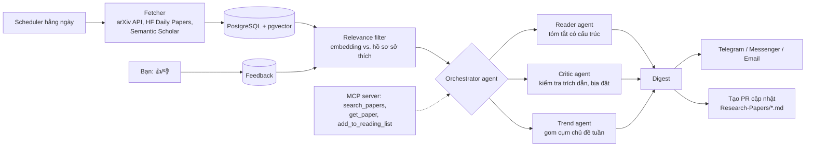

# P12 — Paper Radar: Multi-Agent Research Assistant

> Hệ thống **agent** mỗi sáng tự: lấy bài mới trên arXiv / Hugging Face Daily Papers → lọc theo sở thích của bạn (CV, Quant, LLM…) bằng embedding → agent đọc & tóm tắt (vấn đề, phương pháp, kết quả, **có code không**) → gom cụm chủ đề đang nổi → gửi bản tin qua Telegram/Messenger/email và tự **cập nhật thư mục [`Research-Papers/`](../../Research-Papers/README.md)** của bạn.
> Vừa luyện kỹ năng **Agentic AI + MCP** (xu hướng nóng nhất 2025–2026), vừa là công cụ bạn dùng hằng ngày để theo dõi thế giới nghiên cứu.

| Mục | Chi tiết |
|---|---|
| Hướng | LLM Agents + Backend (scheduler, API) |
| Độ khó | ⭐⭐⭐ |
| Thời gian | 4–5 tuần |
| Bài học áp dụng | [14 Embeddings](https://github.com/microsoft/AI-For-Beginners/tree/main/lessons/5-NLP/14-Embeddings), [20 LangModels](https://github.com/microsoft/AI-For-Beginners/tree/main/lessons/5-NLP/20-LangModels), [23 Multi-agent Systems](https://github.com/microsoft/AI-For-Beginners/tree/main/lessons/6-Other/23-MultiagentSystems) |
| Vị trí phù hợp | AI Engineer (Agents), Backend Engineer |

---

## 1. Kiến trúc

## 2. Kiến thức cần nắm

### Agents / LLM
- [ ] Vòng lặp agent: plan → tool call → observe; khi nào **không** cần agent (pipeline cố định rẻ và ổn định hơn)
- [ ] Structured output (Pydantic): `{title, problem, method, results, code_url, relevance_score, why_relevant}`
- [ ] Chống bịa: mọi thông tin phải trích từ abstract/full-text; critic agent kiểm tra lại
- [ ] **Model Context Protocol**: tự viết một MCP server (tool `search_papers`, `get_paper`) để dùng được từ Claude Desktop/IDE ([modelcontextprotocol/python-sdk](https://github.com/modelcontextprotocol/python-sdk))
- [ ] Memory: hồ sơ sở thích cập nhật theo feedback 👍/👎 (tương tự recommender P11)
- [ ] Đánh giá: precision@10 của bộ lọc so với lựa chọn của chính bạn trong 2 tuần

### Backend
- [ ] Gọi API có giới hạn tốc độ (arXiv yêu cầu chờ giữa các request), cache, retry
- [ ] Job scheduler (cron / APScheduler / Prefect), idempotent theo ngày
- [ ] Bot Telegram ([python-telegram-bot](https://github.com/python-telegram-bot/python-telegram-bot)) hoặc tái dùng bot Messenger từ P02
- [ ] GitHub API: tự tạo nhánh + PR cập nhật file `.md`
- [ ] Giới hạn chi phí LLM mỗi ngày, log token bằng Langfuse

## 3. Lộ trình

| Tuần | Milestone |
|---|---|
| 1 | Fetcher arXiv ([arxiv.py](https://github.com/lukasschwab/arxiv.py)) + HF papers → DB; embedding + lọc theo từ khóa/sở thích |
| 2 | Reader agent tóm tắt có cấu trúc; gửi digest Telegram |
| 3 | Critic + Trend agent; feedback loop |
| 4 | MCP server; tự tạo PR cập nhật `Research-Papers/` |
| 5 | Đánh giá precision@10, viết blog |

## 4. API & tài liệu

- [arXiv API](https://info.arxiv.org/help/api/index.html) · [Semantic Scholar API](https://api.semanticscholar.org/api-docs/) · [Hugging Face Papers](https://huggingface.co/papers)

## 5. Repo tham khảo

| Repo | Ghi chú |
|---|---|
| [langchain-ai/langgraph](https://github.com/langchain-ai/langgraph) | Orchestration agent dạng đồ thị |
| [pydantic/pydantic-ai](https://github.com/pydantic/pydantic-ai) | Agent framework type-safe |
| [huggingface/smolagents](https://github.com/huggingface/smolagents) | Agent tối giản, dễ đọc code |
| [microsoft/autogen](https://github.com/microsoft/autogen) · [crewAIInc/crewAI](https://github.com/crewAIInc/crewAI) | Multi-agent frameworks |
| [stanfordnlp/dspy](https://github.com/stanfordnlp/dspy) | Tối ưu prompt/pipeline tự động |
| [modelcontextprotocol/servers](https://github.com/modelcontextprotocol/servers) | Ví dụ MCP server |
| [blazickjp/arxiv-mcp-server](https://github.com/blazickjp/arxiv-mcp-server) | MCP server cho arXiv (tham khảo) |
| [mem0ai/mem0](https://github.com/mem0ai/mem0) | Memory cho agent |

## 6. Bài báo liên quan

ReAct, Toolformer, Generative Agents, AutoGen, DSPy, MemGPT, Mem0, *Survey of Context Engineering*, *MCP: Landscape & Security*, *Survey on Agent System and Harness Design* (2026), Paper2Agent, ARIS (2026) — xem [02-LLM-Agents-RAG.md](../../Research-Papers/02-LLM-Agents-RAG.md).

## 7. Trình bày trên CV

- *"Built a multi-agent research assistant that triages __ new arXiv papers/day with embedding-based filtering (precision@10 __ vs my manual picks), structured LLM summaries with a critic agent, an MCP server, and automated GitHub PRs."*
