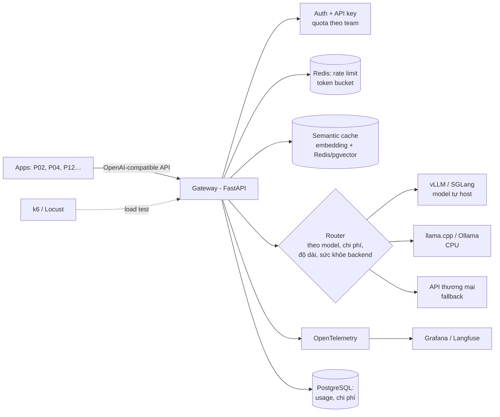

# P13 — LLM Gateway & Inference Platform (hướng AI Infrastructure)

> Tự xây "cổng" dùng chung cho mọi ứng dụng LLM trong công ty (giả lập): **một API tương thích OpenAI** phía trước nhiều backend (model tự host bằng vLLM/llama.cpp + API thương mại), có **xác thực, rate limit, định tuyến, fallback, semantic cache, đếm token/chi phí, tracing**, và **benchmark hiệu năng** (TTFT, tokens/s, p99) dưới tải.
> Đây là dự án thể hiện rõ nhất chữ **"Backend"** trong "Backend + AI". Các dự án P02, P04, P12 có thể dùng chung gateway này.

| Mục | Chi tiết |
|---|---|
| Hướng | Backend + AI Infra / MLOps |
| Độ khó | ⭐⭐⭐⭐⭐ |
| Thời gian | 6–8 tuần |
| Bài học áp dụng | [18 Transformers](https://github.com/microsoft/AI-For-Beginners/tree/main/lessons/5-NLP/18-Transformers), [20 LangModels](https://github.com/microsoft/AI-For-Beginners/tree/main/lessons/5-NLP/20-LangModels) |
| Vị trí phù hợp | Backend Engineer (AI platform), MLOps / ML Platform Engineer, AI Infra Engineer |
| GPU | Không bắt buộc: model nhỏ (≤ 3B, lượng tử hóa) chạy CPU bằng llama.cpp/Ollama; benchmark vLLM trên GPU Colab/Kaggle |

---

## 1. Kiến trúc

## 2. Kiến thức cần nắm

### LLM inference (hiểu "bên trong")
- [ ] Prefill vs. decode; **KV cache**; vì sao decode bị giới hạn bởi băng thông bộ nhớ
- [ ] Continuous batching, **PagedAttention** (vLLM), prefix caching / RadixAttention (SGLang)
- [ ] Lượng tử hóa: GPTQ, AWQ, GGUF (llama.cpp); đánh đổi chất lượng ↔ tốc độ
- [ ] Speculative decoding (draft model, EAGLE)
- [ ] Metric: **TTFT** (time to first token), **TPOT/ITL**, throughput (tokens/s), goodput theo SLO
- [ ] Xu hướng: tách prefill/decode (DistServe, Mooncake), KV cache ngoài GPU (LMCache) — đọc paper trong [04-ML-Systems-MLOps-RecSys.md](../../Research-Papers/04-ML-Systems-MLOps-RecSys.md)

### Backend / hệ thống
- [ ] Thiết kế API tương thích OpenAI (`/v1/chat/completions`, streaming SSE)
- [ ] Proxy streaming hiệu quả (không buffer toàn bộ response), hủy request khi client ngắt
- [ ] Rate limiting phân tán (token bucket trong Redis, Lua script), quota theo token
- [ ] Routing + health check + circuit breaker + retry có giới hạn + fallback
- [ ] Semantic cache: ngưỡng similarity, TTL, khi nào **không** được cache (dữ liệu cá nhân, câu hỏi phụ thuộc thời gian)
- [ ] Đo lường & tính tiền: đếm token vào/ra, lưu usage theo key
- [ ] Observability: trace từng request qua gateway → backend (OpenTelemetry)
- [ ] Bảo mật: không log prompt nhạy cảm, lọc prompt injection cơ bản, secret management
- [ ] Triển khai: Docker Compose → (tùy chọn) Kubernetes + [KServe](https://github.com/kserve/kserve)

## 3. Lộ trình

| Tuần | Milestone |
|---|---|
| 1 | Chạy model nhỏ bằng llama.cpp/Ollama + vLLM (Colab); đo TTFT/tokens/s cơ bản |
| 2 | Gateway FastAPI tương thích OpenAI, streaming SSE, auth API key |
| 3 | Rate limit + quota + usage DB |
| 4 | Router nhiều backend + fallback + circuit breaker |
| 5 | Semantic cache; đo cache hit rate & chất lượng |
| 6 | OpenTelemetry + Grafana/Langfuse dashboard |
| 7–8 | Benchmark có hệ thống: batch size, quantization, concurrency → biểu đồ latency–throughput; viết blog |

## 4. Repo tham khảo

| Repo | Ghi chú |
|---|---|
| [vllm-project/vllm](https://github.com/vllm-project/vllm) | Inference engine phổ biến nhất (PagedAttention) |
| [sgl-project/sglang](https://github.com/sgl-project/sglang) | Inference engine (RadixAttention) |
| [ggml-org/llama.cpp](https://github.com/ggml-org/llama.cpp) · [ollama/ollama](https://github.com/ollama/ollama) | Chạy trên CPU/GPU phổ thông |
| [BerriAI/litellm](https://github.com/BerriAI/litellm) | Gateway mã nguồn mở — đọc code để học, rồi tự viết bản của bạn |
| [LMCache/LMCache](https://github.com/LMCache/LMCache) | KV cache layer |
| [langfuse/langfuse](https://github.com/langfuse/langfuse) | LLM observability |
| [open-telemetry/opentelemetry-python](https://github.com/open-telemetry/opentelemetry-python) | Tracing |
| [grafana/k6](https://github.com/grafana/k6) · [locustio/locust](https://github.com/locustio/locust) | Load test |
| [kserve/kserve](https://github.com/kserve/kserve) | Serving trên Kubernetes |

## 5. Bài báo liên quan

FlashAttention 1/2/3, PagedAttention (vLLM), SGLang, Speculative Decoding, EAGLE, DistServe, Mooncake, LMCache, DualPath (2026), SPEED-Bench (2026), GPTQ, AWQ, QLoRA — xem [04-ML-Systems-MLOps-RecSys.md](../../Research-Papers/04-ML-Systems-MLOps-RecSys.md).

## 6. Trình bày trên CV

- Biểu đồ latency–throughput theo concurrency; bảng cache hit rate × tiết kiệm chi phí.
- *"Built an OpenAI-compatible LLM gateway (FastAPI, Redis token-bucket rate limiting, semantic cache, multi-backend routing with circuit breakers, OpenTelemetry tracing); benchmarked vLLM vs llama.cpp — TTFT p95 __ ms, __ tok/s at __ concurrent users; semantic cache cut cost __%."*
