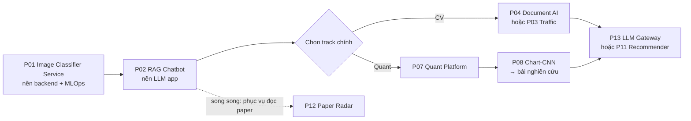

# Project Ideas — Hướng Backend + AI (CV · Quant · LLM)

> Danh sách dự án gợi ý để **áp dụng các mô hình từ khóa [Microsoft AI-For-Beginners](https://github.com/microsoft/AI-For-Beginners)** (bạn đã học) vào sản phẩm thực tế, đồng thời xây profile phù hợp các vị trí **Backend Engineer / ML Engineer / AI Engineer / Quant Developer**.
> Tất cả dự án **chỉ cần phần mềm** (không đụng phần cứng). GPU: dùng Google Colab / Kaggle Notebooks miễn phí khi cần train.
>
> Mỗi dự án có một thư mục riêng, bên trong là `README.md` gồm: bài toán → kiến trúc → tech stack → **checklist kiến thức cần biết** → lộ trình milestone → dữ liệu → repo GitHub tham khảo → bài báo liên quan → cách trình bày trên CV.
>
> Thư mục bài báo khoa học: [`../Research-Papers/`](../Research-Papers/README.md)

---

## 0. Đọc trước

| File | Nội dung |
|---|---|
| [00-Core-Skills-Backend-AI.md](00-Core-Skills-Backend-AI.md) | Kiến thức **nền tảng dùng chung** cho mọi dự án (Python, API, DB, Docker, CI/CD, MLOps, LLM). Học song song khi làm P01–P02. |

---

## 1. Bảng tổng hợp dự án

Độ khó: ⭐ (dễ) → ⭐⭐⭐⭐⭐ (khó). Thời gian ước lượng cho 1 người, ~10–15 giờ/tuần.

### Track 0 — Nền tảng Backend + AI (nên làm đầu tiên)

| # | Dự án | Bài học áp dụng | Độ khó | Thời gian | Thể hiện năng lực |
|---|---|---|---|---|---|
| P01 | [Image Classifier as a Service](P01-Image-Classifier-Service/README.md) — phân loại 30 món ăn Việt, phục vụ qua API | 07 CNN, 08 Transfer Learning | ⭐⭐ | 3–4 tuần | Model serving, FastAPI, Docker, CI/CD, monitoring |
| P02 | [RAG Chatbot trên Messenger](P02-RAG-Chatbot-Messenger/README.md) — **nâng cấp `fb-messenger-bot` bạn đang có** | 13–14 Embeddings, 18 Transformers, 20 LLM | ⭐⭐⭐ | 4–5 tuần | LLM app, vector DB, webhook, async, đánh giá RAG |

### Track A — Computer Vision

| # | Dự án | Bài học áp dụng | Độ khó | Thời gian | Thể hiện năng lực |
|---|---|---|---|---|---|
| P03 | [Traffic Video Analytics](P03-Traffic-Video-Analytics/README.md) — đếm xe, theo dõi, đọc biển số từ video | 11 Object Detection, 12 Segmentation | ⭐⭐⭐⭐ | 5–7 tuần | Xử lý video, stream, queue, time-series DB, dashboard realtime |
| P04 | [Vietnamese Document AI](P04-Vietnamese-Document-AI/README.md) — trích xuất hóa đơn/chứng từ → JSON | 07 CNN, 16 RNN (CRNN), 18 Transformers, X1 Multimodal | ⭐⭐⭐⭐ | 5–6 tuần | OCR + VLM, pipeline async, human-in-the-loop, **rất sát nhu cầu doanh nghiệp VN** |
| P05 | [Visual Search Engine](P05-Visual-Search-Engine/README.md) — tìm sản phẩm bằng ảnh/bằng câu mô tả | 14 Embeddings, X1 Multimodal (CLIP) | ⭐⭐⭐ | 3–4 tuần | Vector search, ANN index, đánh giá retrieval |
| P06 | [Industrial Defect Detection](P06-Industrial-Defect-Detection/README.md) — phát hiện lỗi sản phẩm không cần nhãn lỗi | 09 Autoencoders, 12 Segmentation | ⭐⭐⭐ | 3–5 tuần | Anomaly detection, dashboard review, active learning |

### Track B — Quant / Tài chính định lượng

| # | Dự án | Bài học áp dụng | Độ khó | Thời gian | Thể hiện năng lực |
|---|---|---|---|---|---|
| P07 | [VN Quant Research Platform](P07-VN-Quant-Research-Platform/README.md) — data pipeline + factor research + backtest cho HOSE | 05 Frameworks, 16 RNN, 18 Transformers | ⭐⭐⭐⭐ | 6–8 tuần | Data engineering, time-series ML, backtest chống overfitting |
| P08 | [Chart-Image CNN (nghiên cứu)](P08-Chart-Image-CNN-Research/README.md) — tái lập bài *(Re-)Imag(in)ing Price Trends* trên thị trường VN | 07 CNN, 08 Transfer Learning | ⭐⭐⭐⭐ | 6–10 tuần | **Kết hợp CV + Quant**, có tiềm năng thành bài báo |
| P09 | [Financial News NLP + Event Study](P09-Financial-News-NLP-Event-Study/README.md) — tin tức tiếng Việt → cảm xúc → tác động giá | 13 TextRep, 19 NER, 18 Transformers, 20 LLM | ⭐⭐⭐⭐ | 5–7 tuần | NLP tiếng Việt, crawler, thống kê tài chính |
| P10 | [RL Portfolio + Genetic Alpha Mining](P10-RL-Portfolio-GA-Alpha/README.md) | 21 Genetic Algorithms, 22 Deep RL | ⭐⭐⭐⭐ | 5–7 tuần | RL, tối ưu danh mục, genetic programming |

### Track C — Backend + AI nâng cao / hướng đi khác

| # | Dự án | Bài học áp dụng | Độ khó | Thời gian | Thể hiện năng lực |
|---|---|---|---|---|---|
| P11 | [Real-time Recommender System](P11-Realtime-Recommender-System/README.md) — hệ gợi ý kiểu e-commerce | 14 Embeddings, 05 Frameworks | ⭐⭐⭐⭐ | 6–8 tuần | Kafka, feature store, two-tower, A/B test — **nhu cầu tuyển dụng lớn** |
| P12 | [Paper Radar — Multi-Agent Research Assistant](P12-Paper-Radar-Multi-Agent/README.md) — tự đọc arXiv mỗi ngày, lọc theo sở thích, tóm tắt | 14 Embeddings, 20 LLM, 23 Multi-agent | ⭐⭐⭐ | 4–5 tuần | Agent, MCP, scheduler, **phục vụ chính việc nghiên cứu của bạn** |
| P13 | [LLM Gateway & Inference Platform](P13-LLM-Gateway-Inference-Platform/README.md) — tự host LLM, gateway, cache, observability | 18 Transformers, 20 LLM | ⭐⭐⭐⭐⭐ | 6–8 tuần | LLM serving, load test, tối ưu latency/cost — hướng "AI Infra" |

---

## 2. Lộ trình đề xuất (không cần làm hết!)

Nhà tuyển dụng đánh giá cao **3–5 dự án làm sâu, có demo, có số liệu** hơn là 13 dự án làm dở. Gợi ý:

| Giai đoạn | Việc chính | Kết quả mong đợi |
|---|---|---|
| Tháng 1–2 | P01 + học [00-Core-Skills](00-Core-Skills-Backend-AI.md) | 1 API có Docker, test, CI, deploy công khai |
| Tháng 2–3 | P02 (nâng cấp bot Messenger) | 1 ứng dụng LLM/RAG có bộ đánh giá |
| Tháng 4–6 | 1 dự án flagship trong track bạn chọn (P04 hoặc P07) | Dự án "đinh" cho CV, có blog/video demo |
| Tháng 6–9 | P08 (hoặc 1 đề tài từ [Research-Ideas](../Research-Papers/06-Research-Ideas.md)) | Báo cáo kỹ thuật → hướng tới bài báo hội nghị/SV NCKH |
| Tháng 9–12 | P13 hoặc P11 | Chứng minh năng lực hệ thống quy mô lớn |

**Nguyên tắc chọn:**
- Thiên về **Backend + AI Engineer** → P01, P02, P04, P13 (+P11).
- Thiên về **Computer Vision Engineer** → P01, P03/P04, P05, P06.
- Thiên về **Quant Researcher/Developer** → P07, P08, P09, P10 (P08 là "cầu nối" CV ↔ Quant, rất hợp với bạn).
- Muốn **nghiên cứu khoa học** → P08, P09 hoặc các ý tưởng ở [06-Research-Ideas.md](../Research-Papers/06-Research-Ideas.md).

---

## 3. Chuẩn "Definition of Done" cho mọi dự án (để đưa lên CV)

- [ ] `README.md` có: bài toán, kiến trúc (sơ đồ), cách chạy 1 lệnh (`docker compose up`), kết quả **có số liệu** (accuracy, latency p95, throughput, Sharpe…), hạn chế.
- [ ] Code có cấu trúc (`src/`, `tests/`), type hints, lint (`ruff`), test (`pytest`), CI (GitHub Actions).
- [ ] Có **demo** (link deploy, GIF, hoặc video 1–2 phút).
- [ ] Có **so sánh baseline** (mô hình đơn giản vs. mô hình của bạn) — điều nhà tuyển dụng/giám khảo luôn hỏi.
- [ ] Ghi rõ nguồn dữ liệu, license, và các giả định.
- [ ] 1 bài blog (Viblo / Medium / GitHub Pages) giải thích quyết định kỹ thuật.

**Mẫu bullet CV** (thay số liệu thật của bạn, không bịa):
> *Built a FastAPI service serving a fine-tuned EfficientNet (30 Vietnamese dishes, top-1 acc __%), with Redis caching and ONNX Runtime, reducing p95 latency from __ ms to __ ms; containerized with Docker and deployed via GitHub Actions CI/CD.*

---

## 4. Hướng đi khác đáng cân nhắc (ngoài CV & Quant)

| Hướng | Vì sao đáng quan tâm | Dự án khởi đầu |
|---|---|---|
| **Recommender Systems** | Là "xương sống" doanh thu của e-commerce, fintech, mạng xã hội → tuyển nhiều, rất hợp Backend + AI | P11 |
| **AI Infrastructure / LLM Serving** | Chi phí suy luận LLM là bài toán lớn của mọi công ty dùng AI; cần người hiểu cả hệ thống lẫn mô hình | P13 |
| **Agentic AI + MCP** | Xu hướng nổi bật 2025–2026 (xem [02-LLM-Agents-RAG.md](../Research-Papers/02-LLM-Agents-RAG.md)) | P12 |
| **Document AI** | Ngân hàng, bảo hiểm, kế toán tại VN có nhu cầu số hóa chứng từ rất lớn | P04 |
| **Speech AI tiếng Việt** | ASR/TTS cho call-center, trợ lý ảo; dùng [openai/whisper](https://github.com/openai/whisper) để fine-tune | (mở rộng P02 thành voice bot) |
| **AI Security** | Prompt injection, bảo mật MCP/agent — mảng mới, ít người | (mở rộng P12/P13) |

> ⚠️ Lưu ý với các dự án Quant (P07–P10): mục tiêu là **học & nghiên cứu**, không phải lời khuyên đầu tư. Luôn kiểm định chống overfitting trước khi tin vào bất kỳ kết quả backtest nào.
